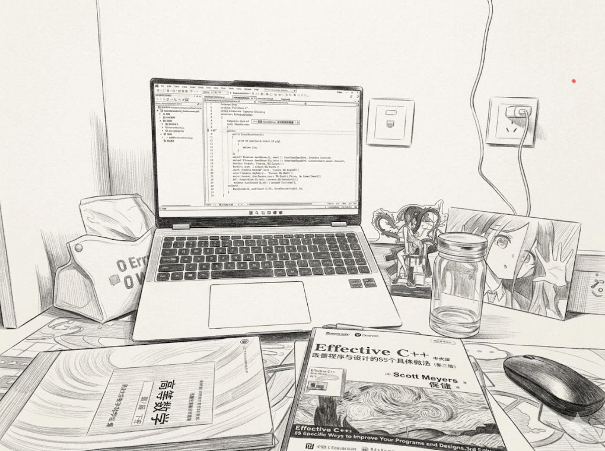
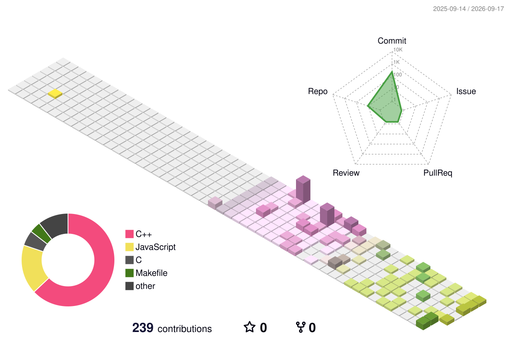

## Ciallo ～(∠・ω< )⌒☆ 

 

* 来自浙江, 长兴县
* ZC 25届

 

=====================

* **CSDN** https://blog.csdn.net/Z2314246476
* **博客** https://zhoubaochuan049.github.io/
* **Email** 3450014365@qq.com
* **QQ** 3450014365
* **公众号** 此方的技术栈

 
 

---

---

### 关注博客：https://zhoubaochuan049.github.io/

最新文章：

<table>
  <thead>
    <tr>
      <th align="left">文章标题</th>
      <th align="center" width="120px">发布日期</th>
      <th align="center" width="100px">跳转链接</th>
    </tr>
  </thead>
  <tbody>
<tr>
  <td>Re：C++11列表初始化&Initializer_List</td>
  <td align="center">2026-03-29</td>
  <td align="center"><a href="https://zhoubaochuan049.github.io/posts/%E6%A0%87%E7%AD%BE%E7%8E%B0%E4%BB%A3cpp%E7%A8%8B%E5%BA%8F%E8%AE%BE%E8%AE%A1/%E7%8E%B0%E4%BB%A3cpp01/">点击阅读</a></td>
</tr>
</tbody>
</table>
